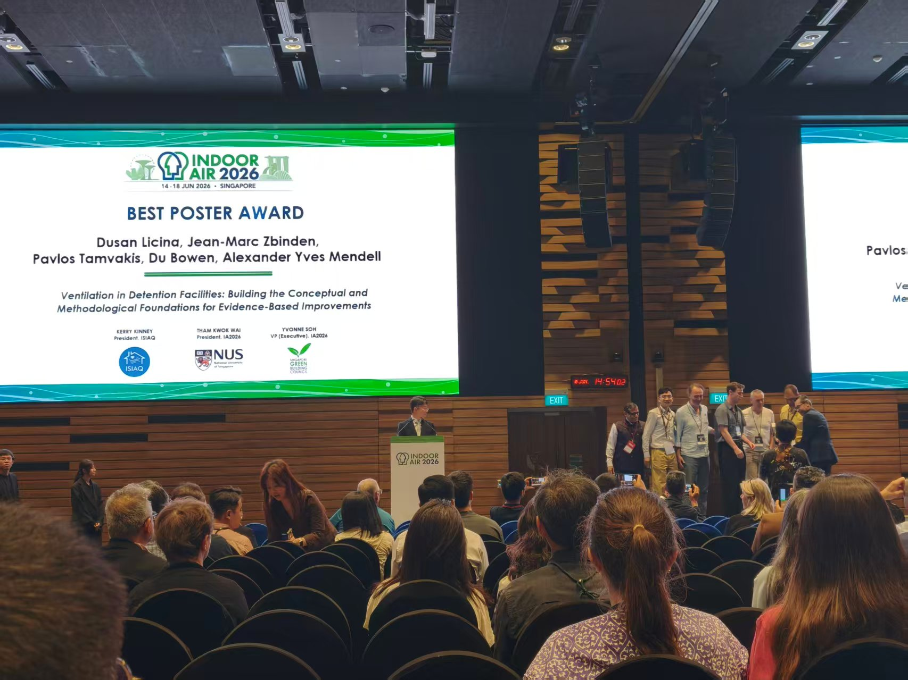

We are pleased to announce that our poster, *"Ventilation in Detention Facilities: Building the Conceptual and Methodological Foundations for Evidence-Based Improvements,"* received the **Best Poster Award** at the **Indoor Air 2026 Conference**, held in Singapore from 14–18 June 2026.

This recognition highlights the strong interest within the indoor air quality community in the interdisciplinary humanitarian-engineering collaboration between **EPFL** and the **ICRC**. It also reflects our shared commitment to ensuring access to healthy indoor air for all